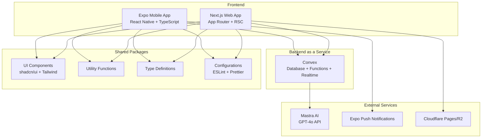

# SmartNippo - 日報管理アプリケーション

> AI機能搭載のモダンな日報管理システム（Expo × Convex × Next.js）

[](https://www.typescriptlang.org/)
[](https://expo.dev/)
[](https://convex.dev/)
[](https://nextjs.org/)

## 📌 概要

SmartNippoは、日報の作成・承認・フィードバックを効率化するためのモバイルファーストなアプリケーションです。AI要約機能により振り返りを効率化し、リアルタイム同期でチームのコミュニケーションを向上させます。

### 主な特徴

- 🚀 **モバイルファースト** - Expo (React Native) によるネイティブアプリ体験
- 🤖 **AI機能** - Mastra GPT-4oによる要約・QA・改善提案
- ⚡ **リアルタイム同期** - Convexによる即座のデータ反映
- 🔐
  **セキュアな権限管理** - ロールベースアクセス制御（viewer/user/manager/admin）
- 📊 **ダッシュボード** - Next.js App Routerによる高速なWeb管理画面
- 🎨 **統一デザイン** - shadcn/ui + Tailwind CSS v4によるモダンなUI

## 🏗️ アーキテクチャ



## 🚀 クイックスタート

### 前提条件

- Node.js 18 LTS以上
- pnpm 8.0以上
- Git
- iOS/Androidデバイスまたはシミュレーター（モバイルアプリ開発用）

### セットアップ手順

1. **リポジトリをクローン**

   ```bash
   git clone git@github.com:your-org/smartnippo.git
   cd smartnippo
   ```

2. **依存関係をインストール**

   ```bash
   pnpm install
   ```

3. **環境変数を設定**

   ```bash
   cp .env.example .env
   # .envファイルに必要な値を設定
   ```

4. **Convexをセットアップ**

   ```bash
   npx convex dev --once --configure=new
   ```

5. **開発サーバーを起動**

   ```bash
   # すべてのサービスを起動
   pnpm dev

   # または個別に起動
   pnpm dev:web     # Next.js Webアプリ
   pnpm dev:mobile  # Expo モバイルアプリ
   pnpm dev:convex  # Convex バックエンド
   ```

6. **アプリケーションにアクセス**
   - Web: http://localhost:3000
   - Mobile: Expo Goアプリでターミナルに表示されるQRコードをスキャン

## 📁 プロジェクト構成

```
smartnippo/
├── apps/
│   ├── mobile/          # Expo モバイルアプリ
│   │   ├── app/         # Expo Router ページ
│   │   ├── components/  # モバイル専用コンポーネント
│   │   └── ...
│   └── web/             # Next.js Webアプリ
│       ├── src/app/     # App Router ページ
│       ├── components/  # Web専用コンポーネント
│       └── ...
├── packages/
│   ├── ui/              # 共通UIコンポーネント
│   ├── lib/             # ユーティリティ関数
│   ├── types/           # TypeScript型定義
│   └── config/          # 共通設定（ESLint, TSConfig等）
├── convex/              # Convexバックエンド
│   ├── schema.ts        # データベーススキーマ
│   └── *.ts             # Convex関数
└── docs/                # プロジェクトドキュメント
```

## 🛠️ 主要コマンド

| コマンド          | 説明                                       |
| ----------------- | ------------------------------------------ |
| `pnpm dev`        | すべてのアプリケーションを開発モードで起動 |
| `pnpm build`      | すべてのアプリケーションをビルド           |
| `pnpm lint`       | ESLintでコード品質をチェック               |
| `pnpm format`     | Prettierでコードをフォーマット             |
| `pnpm test`       | テストを実行                               |
| `pnpm type-check` | TypeScriptの型チェック                     |

## 🔧 技術スタック

### フロントエンド

- **モバイル**: Expo SDK 52 (React Native) + TypeScript
- **Web**: Next.js 15.1 (App Router) + TypeScript
- **UI**: shadcn/ui + Tailwind CSS v4 + lucide-react
- **状態管理**: useSWR + React Context + nuqs

### バックエンド

- **BaaS**: Convex 1.17（データベース + リアルタイム同期 + 関数）
- **AI**: Mastra GPT-4o API
- **認証**: Convex Auth（Magic Link）

### インフラ・ツール

- **CDN**: Cloudflare Pages / R2
- **通知**: Expo Push Notifications
- **モニタリング**: Sentry
- **CI/CD**: GitHub Actions + Turborepo + EAS

## 📱 機能一覧

### ユーザー向け機能

- 日報の作成・編集・削除
- AI要約生成
- リアルタイムコメント
- プッシュ通知
- オフラインサポート

### 管理者向け機能

- 日報の承認・却下
- チームメンバー管理
- 統計ダッシュボード
- 一括エクスポート

## 🔐 セキュリティ

- ロールベースアクセス制御（RBAC）
- 組織間データの完全分離
- HTTPS通信の強制
- セキュアなトークン管理
- 監査ログの自動記録

## 🤝 コントリビューション

コントリビューションは大歓迎です！詳細は[CONTRIBUTING.md](./CONTRIBUTING.md)をご覧ください。

## 📄 ライセンス

このプロジェクトはMITライセンスの下で公開されています。詳細は[LICENSE](./LICENSE)をご覧ください。

## 📞 サポート

- 📧 Email: support@smartnippo.example.com
- 💬 Discord: [SmartNippo Community](https://discord.gg/example)
- 📚 ドキュメント:
  [docs.smartnippo.example.com](https://docs.smartnippo.example.com)

---

<p align="center">Made with ❤️ by SmartNippo Team</p>
