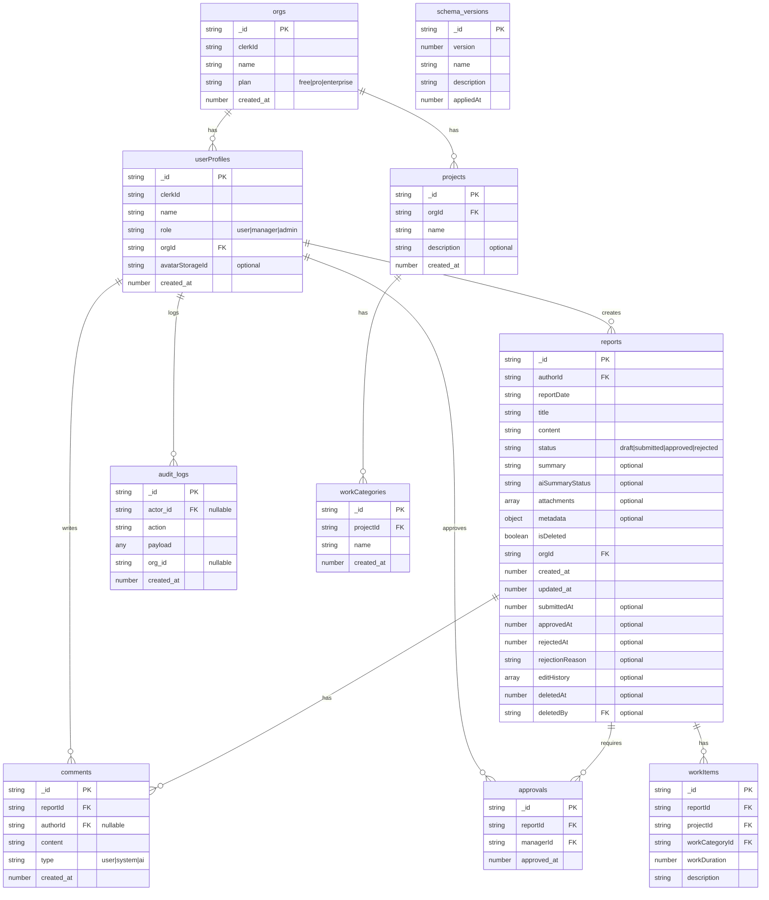

# 日報管理アプリ 要件定義書 (Expo × Convex × Mastra)

> **改訂理由** :
> orgs テーブル追加・ロール拡張・非機能要件強化・リスク対策を反映。

---

## 1. 概要

| 項目         | 内容                                                                                  |
| ------------ | ------------------------------------------------------------------------------------- |
| 目的         | 日報提出・承認・フィードバックをモバイル中心で高速化し、AI 要約で振り返りを効率化する |
| 対象ユーザー | ・**一般ユーザー** (user)・**承認者** (manager)・**管理者** (admin)                   |
| KPI          | ①提出率 ≥95% ②承認24h以内 ③Web LCP≤2.5s/CLS≤0.1 ④Mobile cold‑start≤1.5s               |
| 使用端末     | iOS 15+/Android 11+（Expo）、Chrome/Edge/Safari 最新                                  |

---

## 2. システム構成

| レイヤ        | 技術                                                          | 補足                                                       |
| ------------- | ------------------------------------------------------------- | ---------------------------------------------------------- |
| モバイル      | **Expo (~53.0.12, React Native 0.79.4)**                      | OTA 更新／EAS Build、NativeWind v4 (Tailwind CSS v3ベース) |
| Web           | **Next.js 15.3.4 (App Router)**                               | RSC優先、React 19対応、Cloudflare Pages 配信               |
| UI System     | **shadcn/ui + Tailwind CSS v4.1.10 (Web) / v3.4.17 (Mobile)** | 統一デザインシステム、lucide-react icons                   |
| BaaS          | **Convex 1.25.0**                                             | DB + Edge Functions + ACL                                  |
| 認証          | **Clerk**                                                     | ソーシャルログイン、Magic Link、MFA対応                    |
| AI            | **Mastra GPT‑4o**                                             | 要約・QA・改善提案 API                                     |
| 状態管理      | **useSWR + nuqs + React Context**                             | 楽観的更新、URL状態、最小グローバル状態                    |
| CDN & Storage | Cloudflare Pages / R2                                         |                                                            |
| モニタリング  | Sentry + Convex logs export                                   |                                                            |
| CI/CD         | GitHub Actions + Turborepo + EAS CLI                          |                                                            |

---

## 3. データモデル

---

## 4. 機能要件

### 4.1 認証 & 権限

- Clerk認証 (ソーシャルログイン、Magic Link、Email/Password)
- Clerk JWT → Convex認証統合
- RLS: `org_id` 完全分離
- ロール別権限:
  - **user**: 自分の日報 CRUD
  - **manager**: チーム日報閲覧/承認/コメント
  - **admin**: 全操作 + org 設定

### 4.2 日報 CRUD & 承認

| 操作 | 権限            | Convex Function       |
| ---- | --------------- | --------------------- |
| 作成 | user 以上       | `createReport`        |
| 更新 | author or admin | `updateReport`        |
| 削除 | author or admin | `deleteReport (soft)` |
| 承認 | manager 以上    | `approveReport`       |
| 拒否 | manager 以上    | `rejectReport`        |
| 復旧 | admin のみ      | `restoreReport`       |

**Note**: Next.js 15.3.4 App Router (React 19対応) では API
Routes を使用せず、Convex mutations/queries を直接使用。Server
Components優先でSSR最適化

### 4.3 コメント & AI

- `addComment` (user/system)
- `askAI` (Mastra QA) → system コメント保存
- `improveSuggestion` after approve → suggestion コメント

### 4.4 監査ログ

- 重要操作 (`approveReport`, `deleteReport`, role 変更) は `audit_logs`
  に自動 insert

### 4.5 バックアップ / DR

- **自動バックアップ**: 24時間間隔でフルバックアップ、増分バックアップ対応
- **スキーマバージョニング**: `schema_versions` テーブルでマイグレーション管理
- **データ整合性**: チェックサム生成・検証による整合性保証
- **復旧手順**:
  5段階復旧プロセス（バックアップ確認→システム停止→復旧→検証→再開）
- **保持期間**: 30日分のバックアップを保持、90日後自動削除
- **バリデーション**: サーバーサイドデータバリデーション、エラーログ記録
- 目標: RPO ≤24h, RTO ≤4h

### 4.6 国際化 (i18n)

- UI 文言を `react-i18next` で管理。初期は `ja`, `en` 提供

### 4.7 通知

- Expo Push (新規コメント・承認完了・AI 返信完了)

### 4.8 受け入れ基準 (DoD)

- 各ユーザーストーリーに E2E テストが通過
- ESLint/TypeScript エラーゼロ
- Lighthouse モバイル LCP 2.5s 以内
- Jest カバレッジ 80% 以上

---

## 5. 非機能要件

| カテゴリ             | 指標 / 要件                                                              |
| -------------------- | ------------------------------------------------------------------------ |
| **可用性**           | SLA 99.9%, Multi‑AZ (Convex)                                             |
| **性能**             | Web LCP ≤2.5s, CLS ≤0.1, API P95 ≤300 ms                                 |
| **DR**               | RPO ≤24h, RTO ≤4h                                                        |
| **セキュリティ**     | OWASP Top10 対策, Least Privilege ACL, HTTPS 強制                        |
| **監査**             | 全操作を `audit_logs`, 保存 1 年                                         |
| **コスト**           | 月額上限 ¥20,000。Convex/Cloudflare/Mastra 使用量を毎日集計し Slack 通知 |
| **法規制**           | GDPR & 日本個人情報保護法 (APPI) 準拠。30 日以内の削除要求対応           |
| **アクセシビリティ** | WCAG 2.1 AA (色コントラスト 4.5:1 など)                                  |

---

## 6. パフォーマンス & モニタリング

- **Web**: Next.js 15.1.3 App Router RSC + React 19, Cloudflare Pages
  Edge キャッシュ, `next/image` で画像最適化, shadcn/ui + Tailwind CSS
  v4.1.10 コンポーネント最適化
- **Mobile**: NativeWind v4, bundle splitting, Hermes + RAM bundles,
  lucide-react-native アイコン最適化
- **状態管理**: useSWR 楽観的更新, nuqs URL状態管理, React Context 最小構成
- **モニタリング**: Sentry (error rate), Convex Observability (queries/sec),
  Core Web Vitals tracking
- **CI/CD**: Lighthouse CI + React Native Performance plugin,
  demo/ 手動テストページ

---

## 7. CI/CD & 開発フロー

| 項目         | 内容                                                               |
| ------------ | ------------------------------------------------------------------ |
| ブランチ戦略 | Trunk‑based; `main` 保護、Feature ブランチ PR                      |
| CI           | GitHub Actions (`lint`, `typecheck`, `unit`, `e2e`, `lighthouse`)  |
| CD           | Cloudflare Pages Preview → Prod, Convex `deploy`, EAS Build/Update |
| コード規約   | Conventional Commits, Prettier auto‑format                         |
| コスト監視   | `scripts/cost-report.ts` → Cron in GitHub Actions → Slack 通知     |

---

## 8. リスク & 対策

| リスク               | 対策                                               |
| -------------------- | -------------------------------------------------- |
| Mastra API 遅延/障害 | Retry ×3, 30 s フォールバックで空 summary, UI 通知 |
| Convex 書込競合      | Optimistic UI + Server merge, nightly diff test    |
| 大量 Push 通知スパム | Throttle 15 min per user per report                |
| 法規制変更           | 年 1 回コンプライアンスレビュー                    |

---

## 9. マイルストーン (Fast MVP)

| フェーズ             | 完了条件                                    |
| -------------------- | ------------------------------------------- |
| **M0** 要件確定      | 本書レビュー承認                            |
| **M1** 基盤構築      | Auth & RLS 動作、Schema deploy 成功         |
| **M2** CRUD 完成     | 日報作成→承認→コメント E2E テスト通過       |
| **M3** AI 統合       | 要約・AskAI 機能稼働、fallback 動作確認     |
| **M4** QA & リリース | SLA/SLO 計測合格、App Store / Prod デプロイ |

---

> **備考** : 本改訂版は実装チェックリスト rev.
> FINAL と完全対応しつつ、長期運用に必要な非機能・リスクを補強しました。追加の要望があれば随時アップデートします。
