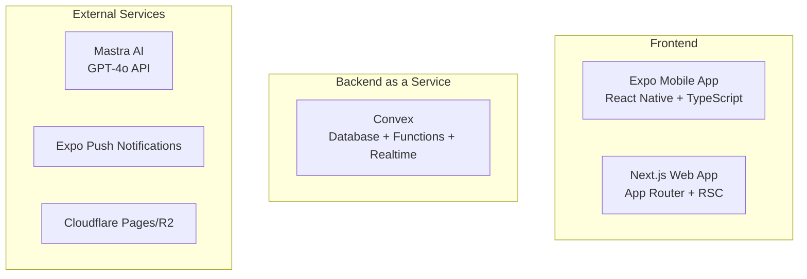

# SmartNippo
## 技術スタック紹介

**AI機能搭載のモダンな日報管理システム**

---

# 目次

1. **プロジェクト概要**
2. **アーキテクチャ全体像**
3. **フロントエンド技術スタック**
4. **バックエンド技術スタック**
5. **開発ツール・インフラ**
6. **技術選択の理由**
7. **まとめ**

---

# プロジェクト概要

## SmartNippoとは？

- 📱 **モバイルファースト**な日報管理アプリケーション
- 🤖 **AI機能**による要約・QA・改善提案
- ⚡ **リアルタイム同期**でチームコラボレーション
- 🔐 **セキュアな権限管理**（RBAC）

---

# 技術スタック概要

## 主要技術

| 分野 | 技術 |
|------|------|
| **Mobile** | Expo SDK 52 (React Native) |
| **Web** | Next.js 15.1 (App Router) |
| **Backend** | Convex 1.17 (BaaS) |
| **UI** | shadcn/ui + Tailwind CSS v4 |
| **AI** | Mastra GPT-4o API |
| **Language** | TypeScript |

---

# アーキテクチャ全体像



---

# モノレポ構成

## プロジェクト構造

```
smartnippo/
├── apps/
│   ├── mobile/          # Expo モバイルアプリ
│   └── web/             # Next.js Webアプリ
├── packages/
│   ├── ui/              # 共通UIコンポーネント
│   ├── lib/             # ユーティリティ関数
│   ├── types/           # TypeScript型定義
│   └── config/          # 共通設定
└── convex/              # Convexバックエンド
```

---

# パッケージマネージャー

## pnpm の採用

- **高速なインストール**
- **効率的なディスク使用量**
- **モノレポサポート**
- **lockfile の安定性**

```json
{
  "packageManager": "pnpm@10.12.1"
}
```

---

# フロントエンド技術スタック
## Mobile App

### Expo SDK 52
- **React Native** ベースのクロスプラットフォーム開発
- **Expo Router** による型安全なナビゲーション
- **OTA Updates** でリアルタイム更新
- **Push Notifications** 標準サポート

---

# Expo の特徴

## 開発効率の向上

- 📱 **クロスプラットフォーム** - iOS/Android同時開発
- 🔄 **Hot Reload** - 即座のコード反映
- 📦 **Managed Workflow** - 設定の簡素化
- 🚀 **EAS Build** - クラウドビルド

---

# フロントエンド技術スタック
## Web App

### Next.js 15.1
- **App Router** による新しいルーティング
- **React Server Components** でパフォーマンス向上
- **Streaming** によるUX改善
- **TypeScript** 完全サポート

---

# Next.js App Router

## 新機能の活用

- **Server Components** - サーバーサイドレンダリング
- **Client Components** - インタラクティブUI
- **Nested Layouts** - 階層化されたレイアウト
- **Route Handlers** - API Routes の進化版

---

# UI/UX 技術スタック

## shadcn/ui + Tailwind CSS v4

### shadcn/ui
- **Copy & Paste** 型コンポーネント
- **Radix UI** ベースのアクセシビリティ
- **カスタマイズ性** の高さ

### Tailwind CSS v4
- **Zero-Config** - 設定ファイル不要
- **Native CSS** - CSS-in-JS不要
- **パフォーマンス** 向上

---

# アイコンライブラリ

## lucide-react

- **1000+** の高品質アイコン
- **Tree-shaking** サポート
- **React** 最適化
- **一貫性** のあるデザイン

```tsx
import { FileText, Send, CheckCircle } from 'lucide-react'
```

---

# 状態管理

## useSWR + React Context + nuqs

### useSWR
- **Data Fetching** ライブラリ
- **キャッシング** 機能
- **リアルタイム** 更新

### nuqs
- **URL状態管理** 
- **型安全** なクエリパラメータ
- **Next.js** 最適化

---

# バックエンド技術スタック
## Convex

### Backend as a Service (BaaS)
- **Database** - ACID準拠
- **Real-time** - WebSocket自動処理
- **Functions** - サーバーレス関数
- **Authentication** - 認証システム内蔵

---

# Convex の特徴

## 開発体験の向上

- **TypeScript First** - 型安全性
- **Real-time by Default** - リアルタイム同期
- **Zero Config** - 設定不要
- **Local Development** - ローカル開発環境

```typescript
// Convex関数の例
export const createReport = mutation({
  args: { title: v.string(), content: v.string() },
  handler: async (ctx, args) => {
    return await ctx.db.insert("reports", args);
  }
});
```

---

# AI 統合

## Mastra GPT-4o API

### 活用機能
- **要約生成** - 日報の自動要約
- **QA機能** - 質問応答
- **改善提案** - フィードバック生成
- **感情分析** - 感情状態の分析

---

# 認証システム

## Convex Auth

### Magic Link認証
- **パスワードレス** 認証
- **セキュリティ** 向上
- **UX** 改善
- **管理コスト** 削減

```typescript
// Magic Link認証の実装
const { signIn } = useAuthActions();

await signIn("resend", { email });
```

---

# 権限管理

## RBAC (Role-Based Access Control)

### 役割定義
- **viewer** - 閲覧のみ
- **user** - 日報作成・編集
- **manager** - 承認・却下
- **admin** - 全権限

---

# インフラ・CDN

## Cloudflare

### Pages
- **静的サイト** ホスティング
- **Edge Computing** 
- **グローバル配信**

### R2
- **オブジェクトストレージ**
- **S3互換** API
- **コスト効率**

---

# 通知システム

## Expo Push Notifications

### 機能
- **Cross-platform** 対応
- **バッチ送信** 機能
- **配信状況** 追跡
- **Rich Notifications** サポート

```typescript
await Notifications.scheduleNotificationAsync({
  content: { title: "新しい日報", body: "確認してください" },
  trigger: null,
});
```

---

# 監視・エラー追跡

## Sentry

### 機能
- **エラー監視** 
- **パフォーマンス監視**
- **リリース追跡**
- **アラート** 機能

---

# 開発ツール・品質管理

## TypeScript + ESLint + Prettier

### TypeScript
- **型安全性** 
- **開発効率** 向上
- **リファクタリング** 支援

### ESLint + Prettier
- **コード品質** 管理
- **統一されたスタイル**
- **自動修正** 機能

---

# CI/CD パイプライン

## GitHub Actions + Turborepo + EAS

### GitHub Actions
- **自動テスト** 実行
- **品質チェック**
- **デプロイ** 自動化

### Turborepo
- **モノレポ** 最適化
- **増分ビルド**
- **並列実行**

---

# モノレポ管理

## Turborepo の活用

### 特徴
- **増分ビルド** - 変更された部分のみ
- **並列実行** - 複数タスクの同時実行
- **リモートキャッシング** - チーム間での共有
- **依存関係** 自動解決

```json
{
  "pipeline": {
    "build": { "dependsOn": ["^build"] },
    "test": { "dependsOn": ["build"] }
  }
}
```

---

# パッケージ管理

## syncpack

### 機能
- **バージョン統一** 
- **依存関係** 管理
- **不整合** 検出
- **自動修正**

```bash
pnpm lint:packages
# パッケージバージョンの不整合をチェック
```

---

# Git管理・品質保証

## Husky + lint-staged + Commitlint

### Husky
- **Git Hooks** 管理
- **コミット前** チェック

### lint-staged
- **ステージされたファイル** のみ処理
- **高速化** 実現

### Commitlint
- **Conventional Commits** 規約
- **コミットメッセージ** 標準化

---

# テスト環境

## Vitest + Convex Test

### Vitest
- **高速** テスト実行
- **ESM** ネイティブサポート
- **TypeScript** 完全サポート

### Convex Test
- **Convex関数** 専用テスト
- **データベース** モッキング
- **リアルタイム** テスト

---

# 技術選択の理由

## なぜこの技術スタックか？

### 開発効率
- **TypeScript** - 型安全性による品質向上
- **Monorepo** - コード共有と管理の効率化
- **Convex** - バックエンド開発の簡素化

### パフォーマンス
- **Next.js RSC** - サーバーサイドレンダリング
- **Expo** - ネイティブパフォーマンス
- **Cloudflare** - グローバル配信

---

# 開発体験の最適化

## Developer Experience (DX)

### 統一された開発環境
- **TypeScript** - 全レイヤーで型安全
- **ESLint/Prettier** - コード品質の統一
- **Turborepo** - 効率的なビルド

### リアルタイム開発
- **Hot Reload** - 即座のフィードバック
- **Convex Dev** - リアルタイムデータ同期
- **Type Generation** - 自動型生成

---

# スケーラビリティ

## 成長に対応する設計

### アーキテクチャ
- **Monorepo** - 複数アプリケーション管理
- **Convex** - 自動スケーリング
- **CDN** - グローバル配信

### 開発チーム
- **TypeScript** - 大規模開発対応
- **共通パッケージ** - 重複コード削減
- **CI/CD** - 自動化による効率化

---

# セキュリティ

## 多層防御

### 認証・認可
- **Magic Link** - パスワードレス認証
- **RBAC** - 役割ベースアクセス制御
- **組織分離** - データの完全分離

### 通信・インフラ
- **HTTPS** - 暗号化通信
- **Cloudflare** - DDoS保護
- **監査ログ** - 操作履歴記録

---

# パフォーマンス最適化

## 最適化戦略

### フロントエンド
- **Code Splitting** - 必要な部分のみ読み込み
- **Image Optimization** - 画像の最適化
- **Caching** - 効率的なキャッシング

### バックエンド
- **Database Indexing** - クエリ最適化
- **Real-time Optimization** - リアルタイム通信の最適化
- **Edge Computing** - エッジでの処理

---

# 今後の展望

## 技術スタックの発展

### 短期的改善
- **パフォーマンス監視** 強化
- **テストカバレッジ** 向上
- **CI/CD** パイプライン最適化

### 中長期的展望
- **AI機能** 拡張
- **多言語対応** 
- **分析機能** 強化

---

# まとめ

## SmartNippo 技術スタックの特徴

✅ **モダンな技術** - 最新のベストプラクティス
✅ **開発効率** - 高い生産性
✅ **型安全性** - TypeScriptによる品質保証
✅ **リアルタイム** - Convexによる即座同期
✅ **スケーラビリティ** - 成長に対応する設計
✅ **セキュリティ** - 多層防御アーキテクチャ

---

# ご質問・ディスカッション

## お聞かせください

- 🤔 **技術選択** について
- 🔧 **実装の詳細** について  
- 🚀 **今後の展望** について
- 💡 **改善提案** について

**ありがとうございました！**